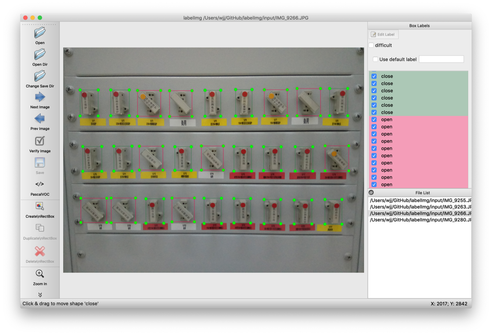

# Customize training with YOLOv3

## 编译darknet
```bash
git clone https://github.com/pjreddie/darknet
cd darknet/
make
```

## 自定义训练工程
* 工程目录结构
```txt
├── darknet53.conv.74　　　　　　基于imagenet的预训练模型
└── open-close　　　　　　　　　工程目录
    ├── backup　　　　　　　　　　存储模型训练时权重值
    ├── cfg　　　　　　　　　　　　配置目录
    │   ├── train.txt　　　　　　　　存储用于训练的图像路径
    │   ├── valid.txt　　　　　　　　存储用于验证的图像路径
    │   ├── voc.data　　　　　　　　配置文件
    │   ├── voc.names　　　　　　　标签名
    │   └── yolov3.cfg　　　　　　　YOLOv3神经网络文件
    ├── data
    │   └── labels　　　　　　　　　预测时用于显示标签名字
    │       ├── 100_0.png
    │       ├── 100_1.png
    │       ├── ......
    │       └── make_labels.py
    ├── images　　　　　　　　　　图像样本集
    │   ├── IMG_9255.JPG
    │   ├── IMG_9263.JPG
    │   ├── IMG_9266.JPG
    │   └── IMG_9280.JPG
    ├── labels　　　　　　　　　　　PASCAL VOC格式的标注
    │   ├── IMG_9255.xml
    │   ├── IMG_9263.xml
    │   ├── IMG_9266.xml
    │   └── IMG_9280.xml
    ├── predictions　　　　　　　　预测后的图像
    │   ├── IMG_9256.jpg
    │   ├── IMG_9265.jpg
    │   ├── IMG_9271.jpg
    │   ├── IMG_9272.jpg
    │   └── IMG_9290.jpg
    ├── test-images　　　　　　　　测试图像
    │   ├── IMG_9256.JPG
    │   ├── IMG_9265.JPG
    │   ├── IMG_9271.JPG
    │   ├── IMG_9272.JPG
    │   └── IMG_9290.JPG
    ├── weights
    │   └── yolov3_final.weights　　训练出来的模型
    └── yolos　　　　　　　　　　　YOLOv3格式的标注
        ├── IMG_9255.JPG
        ├── IMG_9255.txt
        ├── IMG_9263.JPG
        ├── IMG_9263.txt
        ├── IMG_9266.JPG
        ├── IMG_9266.txt
        ├── IMG_9280.JPG
        └── IMG_9280.txt
```

* 使用LabelImg标注图像样本集


* 下载预训练模型[darknet53.conv.74](https://pjreddie.com/media/files/darknet53.conv.74)
```bash
wget https://pjreddie.com/media/files/darknet53.conv.74
```

* 样本训练
```bash
../darknet detector train cfg/voc.data cfg/yolov3.cfg ../darknet53.conv.74
```

* 图像预测
```bash
../darknet detector test cfg/voc.data cfg/yolov3.cfg weights/yolov3_final.weights test-images/IMG_9265.JPG
```


## 参考资料
[YOLO: Real-Time Object Detection](https://pjreddie.com/darknet/yolo/)
